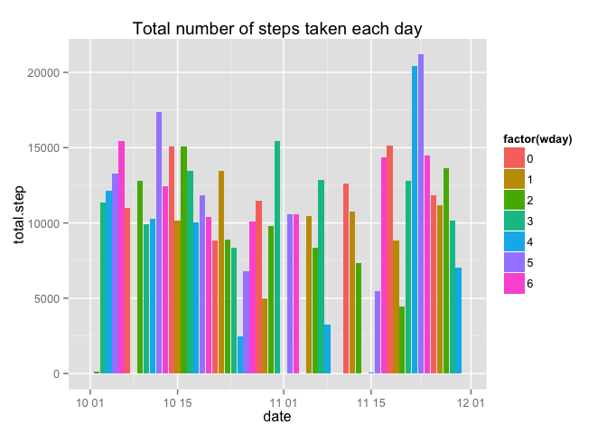
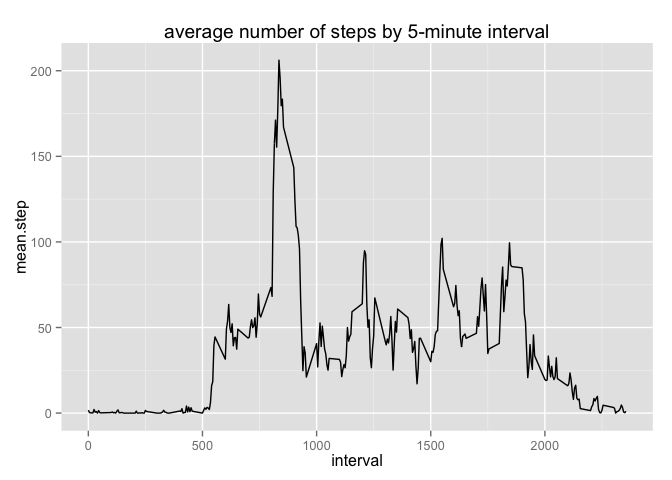
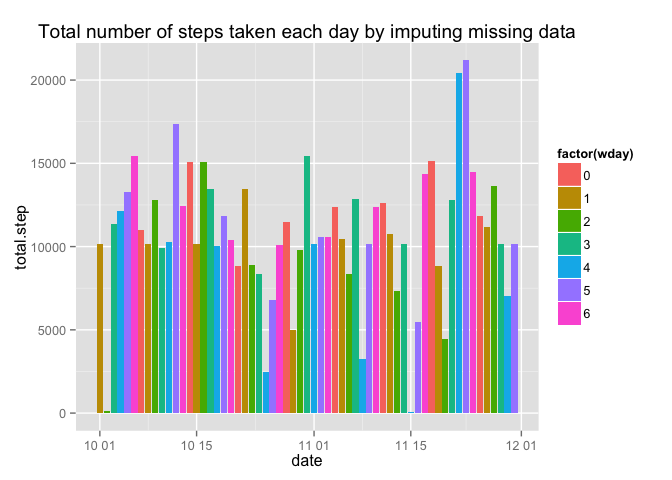
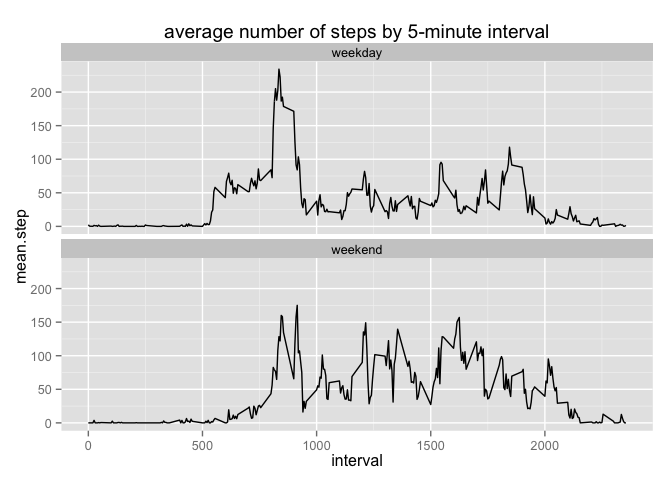

# Reproducible Research: Peer Assessment 1


## Loading and preprocessing the data
set working directory


1. Load the data (i.e. read.csv())

```r
tmpfile <- "repdata-data-activity.zip"
download.file("https://d396qusza40orc.cloudfront.net/repdata%2Fdata%2Factivity.zip", destfile= tmpfile,method="curl")
data.file <- unzip(tmpfile, "activity.csv")
activity.data <- read.csv(data.file, header = TRUE)
summary(activity.data)
```

```
##      steps                date          interval     
##  Min.   :  0.00   2012-10-01:  288   Min.   :   0.0  
##  1st Qu.:  0.00   2012-10-02:  288   1st Qu.: 588.8  
##  Median :  0.00   2012-10-03:  288   Median :1177.5  
##  Mean   : 37.38   2012-10-04:  288   Mean   :1177.5  
##  3rd Qu.: 12.00   2012-10-05:  288   3rd Qu.:1766.2  
##  Max.   :806.00   2012-10-06:  288   Max.   :2355.0  
##  NA's   :2304     (Other)   :15840
```
1. Process/transform the data (if necessary) into a format suitable for your analysis

```r
library(dplyr)
```

```
## 
## Attaching package: 'dplyr'
## 
## The following objects are masked from 'package:stats':
## 
##     filter, lag
## 
## The following objects are masked from 'package:base':
## 
##     intersect, setdiff, setequal, union
```

```r
repro.data <- activity.data %>%
   mutate(date = as.Date(date, format="%Y-%m-%d")) %>%
   mutate(weekday = weekdays(date)) %>% 
   mutate(wday = as.numeric(format(date, "%w"))) %>%
   mutate(is.weekend = wday %in% c(0, 6) )
sapply(repro.data, class)
```

```
##       steps        date    interval     weekday        wday  is.weekend 
##   "integer"      "Date"   "integer" "character"   "numeric"   "logical"
```

```r
head(repro.data[which(repro.data$is.weekend), ])
```

```
##      steps       date interval weekday wday is.weekend
## 1441     0 2012-10-06        0    周六    6       TRUE
## 1442     0 2012-10-06        5    周六    6       TRUE
## 1443     0 2012-10-06       10    周六    6       TRUE
## 1444     0 2012-10-06       15    周六    6       TRUE
## 1445     0 2012-10-06       20    周六    6       TRUE
## 1446     0 2012-10-06       25    周六    6       TRUE
```
## What is mean total number of steps taken per day?
1. Calculate the total number of steps taken per day

```r
summary.data <- repro.data %>%
  group_by(date, wday) %>%
  summarise(total.step = sum(steps, na.rm= TRUE))

summary.data
```

```
## Source: local data frame [61 x 3]
## Groups: date
## 
##          date wday total.step
## 1  2012-10-01    1          0
## 2  2012-10-02    2        126
## 3  2012-10-03    3      11352
## 4  2012-10-04    4      12116
## 5  2012-10-05    5      13294
## 6  2012-10-06    6      15420
## 7  2012-10-07    0      11015
## 8  2012-10-08    1          0
## 9  2012-10-09    2      12811
## 10 2012-10-10    3       9900
## ..        ...  ...        ...
```
1. Make a histogram of the total number of steps taken each day

```r
library(ggplot2)
ggplot(summary.data, aes(x=date,y=total.step, fill=factor(wday)))  +
      geom_bar(stat="identity")  +
         labs(title = "Total number of steps taken each day")
```

 
1. Calculate and report the mean and median of the total number of steps taken per day
1. the mean of the total number of steps taken per day is

```r
(mean.total.step <- mean(summary.data$total.step, na.rm =  TRUE))
```

```
## [1] 9354.23
```
the median of the total number of steps taken per day is

```r
(median.total.step <-median((summary.data$total.step), na.rm =  TRUE))
```

```
## [1] 10395
```


## What is the average daily activity pattern?

```r
summary.interval.data <- repro.data %>%
  group_by(interval) %>%
  summarise(total.step = sum(steps, na.rm= TRUE), 
            mean.step = mean(steps, na.rm = TRUE))
```
1. Make a time series plot (i.e. type = "l") of the 5-minute interval (x-axis) and the average number of steps taken, averaged across all days (y-axis)

```r
ggplot(summary.interval.data, aes(x=interval,y=mean.step) ) +
  geom_line(stat="identity") +
  labs(title = "average number of steps by 5-minute interval")
```

 
1. Which 5-minute interval, on average across all the days in the dataset, contains the maximum number of steps?


```r
mean.step <- summary.interval.data$mean.step
max.interval <- summary.interval.data[which(mean.step == max(mean.step)), ]
```
across all the days in the dataset, interval '835' contains the maximum average number of steps

## Imputing missing values
Note that there are a number of days/intervals where there are missing values (coded as NA). The presence of missing days may introduce bias into some calculations or summaries of the data.

```r
summary(repro.data[, 1:3])
```

```
##      steps             date               interval     
##  Min.   :  0.00   Min.   :2012-10-01   Min.   :   0.0  
##  1st Qu.:  0.00   1st Qu.:2012-10-16   1st Qu.: 588.8  
##  Median :  0.00   Median :2012-10-31   Median :1177.5  
##  Mean   : 37.38   Mean   :2012-10-31   Mean   :1177.5  
##  3rd Qu.: 12.00   3rd Qu.:2012-11-15   3rd Qu.:1766.2  
##  Max.   :806.00   Max.   :2012-11-30   Max.   :2355.0  
##  NA's   :2304
```
1. Calculate and report the total number of missing values in the dataset (i.e. the total number of rows with NAs)

```r
miss.rows.cnt <- dim(repro.data)[1] -  sum(complete.cases(repro.data))
```
total number of rows with NAs is 2304


2. Devise a strategy for filling in all of the missing values in the dataset. 
summarise data to get the mean for that 5-minute interval on weekday/weekend.

```r
summary.interval_weekend.data <- repro.data %>%
        group_by(interval, is.weekend) %>%
        summarise(mean.step = mean(steps, na.rm=TRUE))
```
function to fill missing value by mean of 5-minute interval on weekday/weenend

```r
getSteps <- function (data, summarydata) {  
        if(is.na(data$steps)) {
                # find mean step by interval by workday/weekend
                in_data <- filter(summarydata, 
                                  interval ==data$interval, 
                                  is.weekend == data$is.weekend)
                return (in_data$mean.step)
        } else {
                return (data$steps)
        }
}
```
3. Create a new dataset that is equal to the original dataset but with the missing data filled in.
subset data with missing value 

```r
steps.missing.data <- subset(repro.data, is.na(steps))
```
fill missing steps with mean steps of interval by weekend/workday

```r
rowcnt <- dim(steps.missing.data)[1]
for (i in 1:rowcnt){
        steps.missing.data[i,1] <- getSteps(steps.missing.data[i,], 
                                            summary.interval_weekend.data)
}
subset(steps.missing.data, interval=="0")
```

```
##          steps       date interval weekday wday is.weekend
## 1     2.333333 2012-10-01        0    周一    1      FALSE
## 2017  2.333333 2012-10-08        0    周一    1      FALSE
## 8929  2.333333 2012-11-01        0    周四    4      FALSE
## 9793  0.000000 2012-11-04        0    周日    0       TRUE
## 11233 2.333333 2012-11-09        0    周五    5      FALSE
## 11521 0.000000 2012-11-10        0    周六    6       TRUE
## 12673 2.333333 2012-11-14        0    周三    3      FALSE
## 17281 2.333333 2012-11-30        0    周五    5      FALSE
```
combine data with steps and data missing data filled with mean step by 

```r
# combine repro data 
steps.data <- subset(repro.data, !is.na(steps))
imputing.data <- rbind(steps.missing.data, steps.data)

# arrange imputing data order by date, interval
imputing.data <- arrange(imputing.data, date, as.numeric(interval))
head(imputing.data)
```

```
##       steps       date interval weekday wday is.weekend
## 1 2.3333333 2012-10-01        0    周一    1      FALSE
## 2 0.4615385 2012-10-01        5    周一    1      FALSE
## 3 0.1794872 2012-10-01       10    周一    1      FALSE
## 4 0.2051282 2012-10-01       15    周一    1      FALSE
## 5 0.1025641 2012-10-01       20    周一    1      FALSE
## 6 1.5128205 2012-10-01       25    周一    1      FALSE
```


4. Make a histogram of the total number of steps taken each day and Calculate and report the mean and median total number of steps taken per day. 

1. Calculate the total number of steps taken per day

```r
imputing.summary.data <- imputing.data %>%
  group_by(date, wday) %>%
  summarise(total.step = sum(steps, na.rm= TRUE))

imputing.summary.data
```

```
## Source: local data frame [61 x 3]
## Groups: date
## 
##          date wday total.step
## 1  2012-10-01    1   10177.33
## 2  2012-10-02    2     126.00
## 3  2012-10-03    3   11352.00
## 4  2012-10-04    4   12116.00
## 5  2012-10-05    5   13294.00
## 6  2012-10-06    6   15420.00
## 7  2012-10-07    0   11015.00
## 8  2012-10-08    1   10177.33
## 9  2012-10-09    2   12811.00
## 10 2012-10-10    3    9900.00
## ..        ...  ...        ...
```
1. Make a histogram of the total number of steps taken each day

```r
library(ggplot2)
ggplot(imputing.summary.data, aes(x=date,y=total.step, fill=factor(wday)))  +
      geom_bar(stat="identity") +
      labs(title = "Total number of steps taken each day by imputing missing data")
```

 
1. Calculate and report the mean and median of the total number of steps taken per day  
#### After imputing missing values:
1. the mean of the total number of steps taken per day is  

```r
(imputing.mean.total.step <- mean(imputing.summary.data$total.step, na.rm =  TRUE))
```

```
## [1] 10762.05
```
1. the median of the total number of steps taken per day is  

```r
(imputing.median.total.step <-median((imputing.summary.data$total.step), na.rm =  TRUE))
```

```
## [1] 10571
```

Do these values differ from the estimates from the first part of the assignment? What is the impact of imputing missing data on the estimates of the total daily number of steps?

```r
diff.total.steps <- imputing.mean.total.step - mean.total.step
diff.median.total.step <- imputing.median.total.step - median.total.step
```
after imputing missing data increase mean of total steps per day by 1407.8220141; and median total step per day by 176

## Are there differences in activity patterns between weekdays and weekends?
For this part the weekdays() function may be of some help here. Use the dataset with the filled-in missing values for this part.

1. Create a new factor variable in the dataset with two levels – “weekday” and “weekend” indicating whether a given date is a weekday or weekend day.

```r
final.data <- imputing.data %>%
           mutate( factor.week.day = ifelse(is.weekend, "weekend", "weekday")) %>%
           mutate( factor.week.day = as.factor(factor.week.day))
```
1. Make a panel plot containing a time series plot (i.e. type = "l") of the 5-minute interval (x-axis) and the average number of steps taken, averaged across all weekday days or weekend days (y-axis). See the README file in the GitHub repository to see an example of what this plot should look like using simulated data.

```r
final.summary.data  <- final.data %>%
        group_by(interval, factor.week.day) %>%
        summarise(mean.step = mean(steps, na.rm=TRUE))
final.summary.data
```

```
## Source: local data frame [576 x 3]
## Groups: interval
## 
##    interval factor.week.day mean.step
## 1         0         weekday 2.3333333
## 2         0         weekend 0.0000000
## 3         5         weekday 0.4615385
## 4         5         weekend 0.0000000
## 5        10         weekday 0.1794872
## 6        10         weekend 0.0000000
## 7        15         weekday 0.2051282
## 8        15         weekend 0.0000000
## 9        20         weekday 0.1025641
## 10       20         weekend 0.0000000
## ..      ...             ...       ...
```

```r
ggplot(final.summary.data, aes(x=interval,y=mean.step, col= factor.week.day)) +
  geom_line(stat="identity") +
  labs(title = "average number of steps by 5-minute interval on weekend/weekday")
```

 
